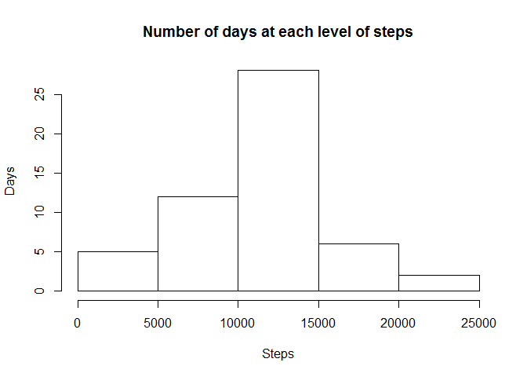
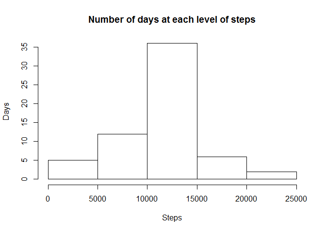
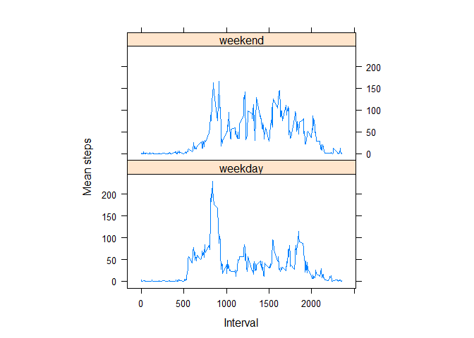

# Reproducible Research: Peer Assessment 1


## Loading and preprocessing the data
Download, unzip and read the input data file.
Convert date from a factor to date format.
Sort the data by date then interval.
Build daily and interval summmaries.


```r
download.file(url = "https://d396qusza40orc.cloudfront.net/repdata%2Fdata%2Factivity.zip",
              destfile = "activity.zip")
unzip("activity.zip")
Activity <- read.csv("activity.csv")
Activity$date <- as.Date(Activity$date)
Activity <- Activity[order(Activity$date, Activity$interval),]
DailySum <- aggregate(steps ~ date, data = Activity, na.rm = TRUE, FUN = sum)
IntMean <- aggregate(steps ~ interval, data = Activity,
                     na.rm = TRUE, FUN = mean)
```


## What is mean total number of steps taken per day?

```r
hist(DailySum$steps, xlab = "Steps", ylab = "Days", 
     main = "Number of days at each level of steps")
```

<!-- -->

```r
meanSteps <- mean(DailySum$steps)
meanSteps
```

```
## [1] 10766.19
```

```r
medianSteps <- median(DailySum$steps)
medianSteps
```

```
## [1] 10765
```

The mean number of steps taken each day is 10766.19

The median number of steps taken each day is 10765


## What is the average daily activity pattern?

```r
with(IntMean, plot(interval, steps, type = "l"))
```

<!-- -->

```r
maxInterval <- with(IntMean, interval[(steps == max(steps))])
```

The interval with the maximum average number of steps is 835


## Imputing missing values

Find number of intervals which are missing step data.


```r
sum(is.na(Activity$steps))
```

```
## [1] 2304
```

Create a new data set, then loop throuhg it and impute values when steps
are missing by using the average steps for that interval overall.

```r
ActivityNew <- Activity
for (i in 1:nrow(ActivityNew)) {
    if (is.na(ActivityNew$steps[i])) {
        ActivityNew$stepSource[i] <- "imputed"
        ActivityNew$newSteps[i] <- 
            IntMean$steps[IntMean$interval == ActivityNew$interval[i]]
    } else {
        ActivityNew$stepSource[i] <- "actual"
        ActivityNew$newSteps[i] <- ActivityNew$steps[i]
    }
}

ActivityNew$stepSource <- as.factor(ActivityNew$stepSource)
```


# Total number of steps taken each day (with imputed data)

```r
DailySumNew <- aggregate(newSteps ~ date, data = ActivityNew, na.rm = TRUE, FUN = sum)

hist(DailySumNew$newSteps, xlab = "Steps", ylab = "Days", 
     main = "Number of days at each level of steps")
```

<!-- -->

```r
meanStepsNew <- mean(DailySumNew$newSteps)
meanStepsNew
```

```
## [1] 10766.19
```

```r
medianStepsNew <- median(DailySumNew$newSteps)
medianStepsNew
```

```
## [1] 10766.19
```

Diference in mean and median between original data and new data with 
imputed values for missing data.

```r
meanDif <- meanStepsNew - meanSteps
meanDif
```

```
## [1] 0
```

```r
medianDif <- medianStepsNew - medianSteps
medianDif
```

```
## [1] 1.188679
```

The mean is the same, which makes sense since imputed data is based on interval
means. The median daily steps is slightly higher.


## Are there differences in activity patterns between weekdays and weekends?
Create a new factor variable to classify as weekends or weekdays

```r
ActivityNew$dayType <- 
    ifelse(((weekdays(ActivityNew$date)) %in% c('Sunday', 'Saturday')),
           'weekend', 'weekday')
```


```r
IntMeanNew <- aggregate(newSteps ~ interval + dayType, data = ActivityNew,
                        FUN = mean)
library(lattice)
with(IntMeanNew, xyplot(newSteps ~ interval | dayType, 
  	                     ylab="Mean steps", xlab="Interval",
                         type = 'l', aspect = 1/2))
```

<!-- -->

